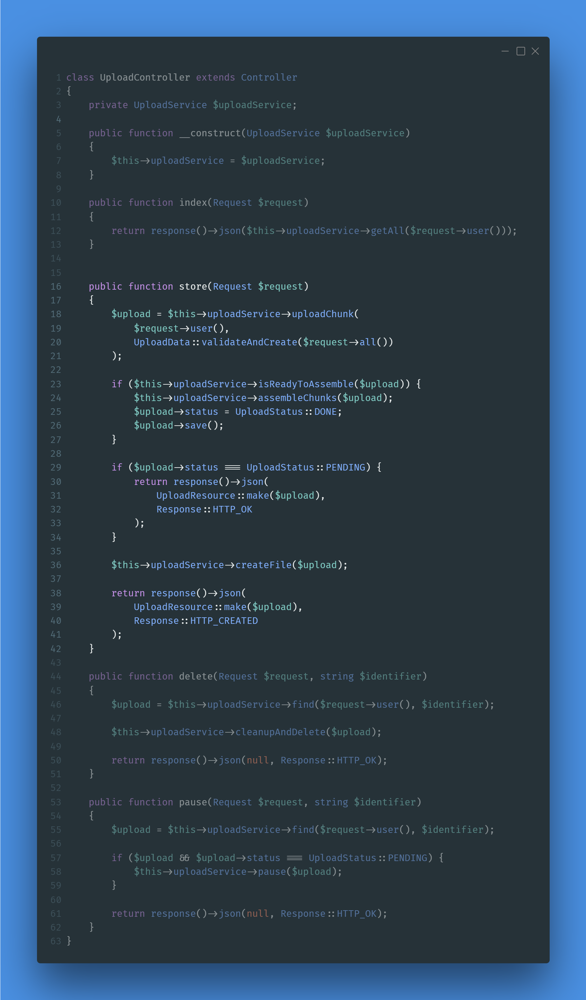

# Laravel Chunk Upload Service

**Laravel Chunk Upload Service** is a powerful package designed to simplify the process of uploading large files in Laravel applications. By breaking down files into smaller, manageable chunks, this service ensures reliable and efficient file transfers, even over unstable network connections.

## Key Features

- **Chunked Uploads:** Splits large files into smaller chunks for improved reliability and easier error recovery.
- **Resumable Uploads:** Supports pausing and resuming of uploads, allowing users to recover from interruptions.
- **Parallel Uploads:** Supports uploading multiple chunks in parallel to speed up the process.
- **Automatic Assembly:** Once all chunks have been received, the service automatically assembles them into the final file.
- **Upload Management:** Provides endpoints to pause, delete, and monitor the status of uploads.
- **Cleanup Mechanism:** Ensures temporary data is removed after uploads are complete or cancelled, keeping the system clean.

## How It Works

1. **Uploading Chunks:**  
   Each file is divided into multiple chunks and sent to dedicated endpoints. The service stores each chunk temporarily on the server.
2. **Validation & Assembly:**  
   When all chunks have been uploaded, the system validates the complete file and merges the chunks into the final file.
3. **Management & Cleanup:**  
   Endpoints allow users to pause or cancel uploads, and the service cleans up any temporary data associated with incomplete uploads.

## Getting Started

- **Installation:**  
  Integrate the package into your Laravel project using Composer and configure it according to your application's needs.
- **Usage:**  
  Utilize the provided controllers (e.g., `UploadController`) and services (e.g., `UploadService`) to handle file uploads. These components manage chunk storage, assembly, and upload lifecycle operations.
- **Documentation:**  
  Detailed usage instructions and examples are available in the project documentation to help you get started quickly.

This service is ideal for applications requiring robust handling of large file uploads—ensuring a seamless and reliable user experience.

---

Explore, contribute, and enjoy efficient file handling with the Laravel Chunk Upload Service.

## Usage

### `FileService` Documentation

The `FileService` class provides methods to manage file operations such as creating, moving, and deleting files.

#### Methods

- **create(User $user, string $path): File|Model**
    - Creates a new file record for the given user and path if it doesn't already exist.
    - **Parameters:**
        - `User $user`: The user who owns the file.
        - `string $path`: The path of the file.
    - **Returns:** The created or existing `File` model.

- **moveToDedicatedDirectory(File $file, string $directory): void**
    - Moves the file to a specified directory and updates its path.
    - **Parameters:**
        - `File $file`: The file to be moved.
        - `string $directory`: The target directory.

- **delete(int $id, ?User $user = null): void**
    - Deletes a file by its ID for the given user.
    - **Parameters:**
        - `int $id`: The ID of the file to be deleted.
        - `?User $user`: The user who owns the file. Defaults to the currently authenticated user.

- **deleteAll(?User $user = null): void**
    - Deletes all files for the given user.
    - **Parameters:**
        - `?User $user`: The user whose files will be deleted. Defaults to the currently authenticated user.

### `UploadService` Documentation

The `UploadService` class provides methods to manage file uploads, including chunked uploads, pausing, and assembling
chunks.

#### Properties

- **$chunksDirectory**
    - Directory for storing upload chunks.
    - **Type:** `string`
    - **Default:** `'temp/chunks'`

- **$filesDirectory**
    - Directory for storing assembled files.
    - **Type:** `string`
    - **Default:** `'files'`

#### Methods

- **getAll(User $user): Collection**
    - Retrieves all uploads for the given user.
    - **Parameters:**
        - `User $user`: The user whose uploads will be retrieved.
    - **Returns:** A collection of uploads.

- **pause(Upload $upload): bool**
    - Pauses an upload by updating its status to `QUEUED`.
    - **Parameters:**
        - `Upload $upload`: The upload to be paused.
    - **Returns:** `true` if the update was successful, otherwise `false`.

- **find(User $user, string $identifier): Upload|null**
    - Finds an upload by its identifier for the given user.
    - **Parameters:**
        - `User $user`: The user who owns the upload.
        - `string $identifier`: The identifier of the upload.
    - **Returns:** The found `Upload` model or `null`.

- **uploadChunk(User $user, UploadData $data): Upload|false**
    - Uploads a chunk of a file.
    - **Parameters:**
        - `User $user`: The user who is uploading the chunk.
        - `UploadData $data`: The data of the chunk being uploaded.
    - **Returns:** The `Upload` model if successful, otherwise `false`.

- **createUpload(User $user, UploadData $data, string $path): Upload**
    - Creates or updates an upload record.
    - **Parameters:**
        - `User $user`: The user who owns the upload.
        - `UploadData $data`: The data of the upload.
        - `string $path`: The path where the upload is stored.
    - **Returns:** The created or updated `Upload` model.

- **createChunk(Upload $upload, UploadData $data)**
    - Creates or updates a chunk record for an upload.
    - **Parameters:**
        - `Upload $upload`: The upload to which the chunk belongs.
        - `UploadData $data`: The data of the chunk being created.

- **isReadyToAssemble(Upload $upload): bool**
    - Checks if an upload is ready to be assembled.
    - **Parameters:**
        - `Upload $upload`: The upload to be checked.
    - **Returns:** `true` if the upload is ready to be assembled, otherwise `false`.

- **isAllChunksUploaded(Upload $upload): bool**
    - Checks if all chunks of an upload have been uploaded.
    - **Parameters:**
        - `Upload $upload`: The upload to be checked.
    - **Returns:** `true` if all chunks are uploaded, otherwise `false`.

- **isTotalChunkSizeEqualToFileSize(Upload $upload): bool**
    - Checks if the total size of all chunks equals the file size.
    - **Parameters:**
        - `Upload $upload`: The upload to be checked.
    - **Returns:** `true` if the sizes match, otherwise `false`.

- **assembleChunks(Upload $upload): bool**
    - Assembles all chunks of an upload into a single file.
    - **Parameters:**
        - `Upload $upload`: The upload to be assembled.
    - **Returns:** `true` if the assembly was successful, otherwise `false`.

- **createFile(Upload $upload): File**
    - Creates a file record from an assembled upload.
    - **Parameters:**
        - `Upload $upload`: The upload to be converted into a file.
    - **Returns:** The created `File` model.

- **moveFile(Model|File $file, string $path): void**
    - Moves a file to a new path and updates its record.
    - **Parameters:**
        - `Model|File $file`: The file to be moved.
        - `string $path`: The new path for the file.

- **cleanupAndDelete(Upload $upload): void**
    - Cleans up and deletes an upload and its chunks.
    - **Parameters:**
        - `Upload $upload`: The upload to be deleted.

- **cleanupChunksDirectory(User $user): void**
    - Cleans up the chunks directory if it is empty.
    - **Parameters:**
        - `User $user`: The user whose chunks directory will be cleaned up.+
